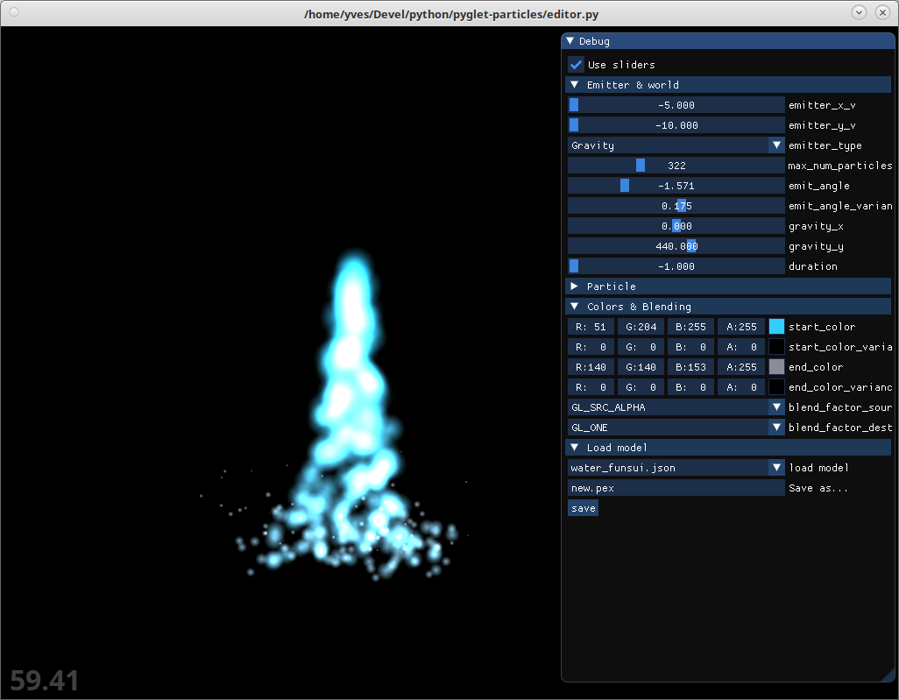
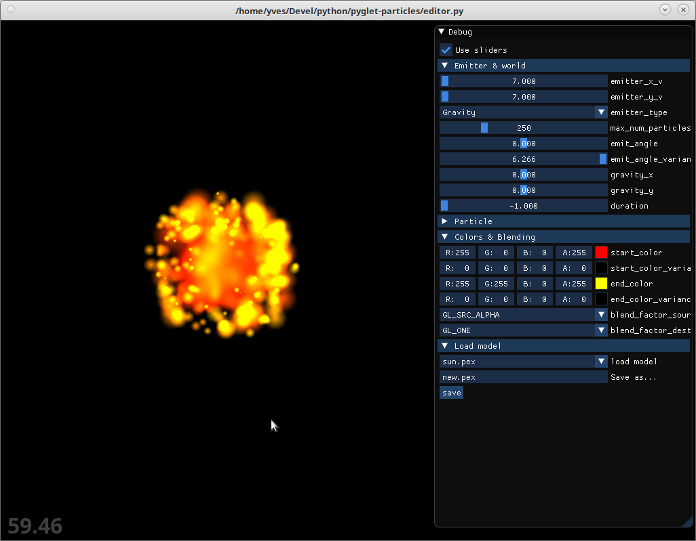

Particle System

A pyglet library for displaying / editing particle systems
    
1 - Requirements
- pyglet (obviously). currently works with pyglet>2.0
- imgui  (editor only)

2 - Features:
- Loads particle systems from *.pex and *.json files
- Editor provided

3 - Usage:
see enclosed demos

3 - Screenshots:

